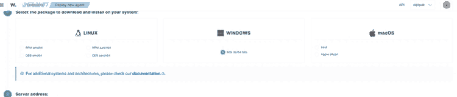
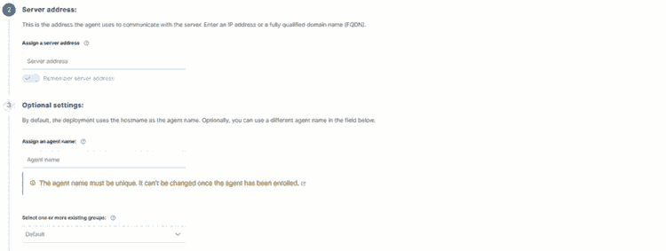
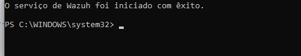

# Instalação do agente Windows

## Objetivo

Instalar e registrar um agente Windows pelo fluxo orientado pelo Dashboard.

## Caminho

```text
Wazuh Dashboard
→ Agents management
→ Summary
→ Deploy new agent
```

## 1. Selecionar o pacote

Selecione:

```text
Windows
MSI 32/64 bits
```

### Evidência — sistemas e pacotes disponíveis



A mesma tela de implantação apresenta opções para Linux, Windows e macOS. Outros sistemas e arquiteturas suportados devem ser consultados na documentação oficial correspondente.

## 2. Server address

O campo **Server address** deve receber o IP ou FQDN do servidor onde o Wazuh Manager está acessível pelo endpoint.

Exemplo:

```text
<WAZUH_SERVER_IP>
```

ou:

```text
wazuh.example.internal
```

Não confundir com o endereço IP do endpoint.

```text
Endpoint Windows
      │
      │ 1514/TCP
      ▼
Wazuh Manager
```

Em ambientes permanentes, prefira um endereço estável, como FQDN ou IP reservado/fixo.

### Evidência — endereço do Manager e opções do agente



O campo **Server address** identifica o Manager que receberá a comunicação do agente. O nome do agente e o grupo podem ser definidos no mesmo fluxo de implantação.

## 3. Agent name

O nome deve identificar o endpoint.

Exemplo:

```text
<AGENT_NAME>
```

O Dashboard alerta que o nome deve ser único e não pode ser alterado depois do enrollment sem recriar o registro.

## 4. Grupo

No laboratório:

```text
windows-lab
```

Criar o grupo antes do enrollment permite que o agente já seja registrado dentro da estrutura de configuração desejada.

## 5. Comando

O Dashboard gera um comando equivalente ao fluxo abaixo:

```powershell
Invoke-WebRequest `
  -Uri https://packages.wazuh.com/4.x/windows/wazuh-agent-4.14.7-1.msi `
  -OutFile $env:TEMP\wazuh-agent.msi

msiexec.exe /i $env:TEMP\wazuh-agent.msi /q `
  WAZUH_MANAGER="<WAZUH_SERVER_IP>" `
  WAZUH_AGENT_GROUP="windows-lab" `
  WAZUH_AGENT_NAME="<AGENT_NAME>"
```

Depois, inicie o serviço conforme orientado pelo Dashboard.

### Evidência — serviço do Wazuh Agent iniciado



## Instalação concluída não significa comunicação validada

A mensagem de que o serviço do Wazuh foi iniciado prova apenas que o serviço Windows iniciou.

A validação real deve ser feita no Dashboard.

```text
serviço iniciado
      ≠
agente conectado
```

## 6. Validar no Dashboard

Caminho:

```text
Agents management
→ Summary / Endpoints
```

Resultado esperado:

```text
Status: active
Version: Wazuh v4.14.7
Group: windows-lab
OS: Windows
```

No laboratório, o endpoint foi registrado no grupo `windows-lab` e passou ao estado `active` após a comunicação com o Manager.

## Status que serão estudados

- `active`;
- `disconnected`;
- `pending`;
- `never connected`.

O laboratório confirmou o agente Windows em `active`.

## Referências

- enrollment requirements:
  https://documentation.wazuh.com/current/user-manual/agent/agent-enrollment/requirements.html
- deployment variables Windows:
  https://documentation.wazuh.com/current/user-manual/agent/agent-enrollment/deployment-variables/deployment-variables-windows.html
- troubleshooting:
  https://documentation.wazuh.com/current/user-manual/agent/agent-enrollment/troubleshooting.html
