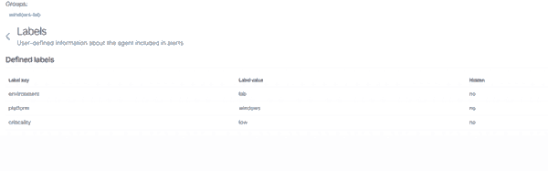

# Configuração centralizada e labels

## Objetivo

Provar que uma alteração feita no `agent.conf` de um grupo é distribuída pelo Manager e aplicada ao agente.

## Fluxo validado

```text
agent.conf do grupo
      ↓
checksum muda
      ↓
Manager distribui
      ↓
agente recebe
      ↓
configuração aparece no endpoint
```

## Configuração usada

Grupo:

```text
windows-lab
```

Arquivo:

```text
/var/ossec/etc/shared/windows-lab/agent.conf
```

Configuração aplicada:

```xml
<agent_config>
  <labels>
    <label key="environment">lab</label>
    <label key="platform">windows</label>
    <label key="criticality">low</label>
  </labels>
</agent_config>
```

## Para que servem labels

Labels adicionam contexto aos dados produzidos pelo agente.

Exemplos possíveis:

```text
environment = production
platform = windows
department = finance
location = site-a
criticality = high
```

Esse contexto pode ajudar em:

- identificação de origem;
- filtros;
- buscas;
- investigação;
- criação de visualizações;
- separação operacional de ativos.

A documentação oficial destaca que labels podem incluir informações específicas do agente nos alertas e podem ser centralizadas pelo `agent.conf`.

Referência:
https://documentation.wazuh.com/current/user-manual/agent/agent-management/labels.html

## Validação 1 — checksum

Antes da mudança, `default` e `windows-lab` tinham o mesmo checksum.

Após salvar as labels:

```text
checksum default      ≠ checksum windows-lab
```

Isso confirmou que o conteúdo compartilhado do grupo foi alterado.

### Evidência — checksum diferente após alterar `agent.conf`


O checksum não prova sozinho que o endpoint já aplicou a configuração. Ele comprova que o Manager reconheceu uma mudança no conteúdo compartilhado do grupo. Por isso, a segunda validação deve ser feita no próprio agente.

## Validação 2 — agente

Caminho:

```text
Endpoints
→ <AGENT_NAME>
→ Configuration
→ Labels
```

Resultado observado:

```text
environment = lab
platform = windows
criticality = low
```

### Evidência — labels recebidas pelo endpoint



A configuração foi aplicada sem editar o endpoint manualmente.

## O que este teste comprovou

```text
configuração criada no grupo
        ↓
Manager detectou a alteração
        ↓
checksum do grupo mudou
        ↓
configuração foi distribuída
        ↓
endpoint passou a exibir as labels
```

Esse teste demonstra, na prática, como uma configuração suportada pelo `agent.conf` pode ser administrada centralmente para todos os agentes pertencentes a um grupo.

## Observação

A configuração centralizada tem regras próprias de suporte e precedência. Nem toda opção do `ossec.conf` pode ser enviada pelo `agent.conf`.

Referência:
https://documentation.wazuh.com/current/user-manual/reference/centralized-configuration.html
